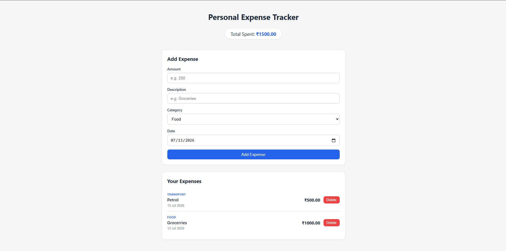

# 💰 Personal Expense Tracker

A full-stack expense tracking application built with the **MERN stack** (MongoDB, Express, React, Node.js). Add, view, and delete expenses with real-time total calculation — clean UI, RESTful API, and cloud-hosted database.


🔗 **Live Demo:** [your-vercel-url.vercel.app](#) &nbsp;|&nbsp; 🔗 **API:** [your-render-url.onrender.com](#)

---
## 📸 Screenshot



## ✨ Features

| Feature | Description |
|---|---|
| ➕ Add Expense | Log expenses with amount, description, category, and date |
| 📋 View Expenses | See all expenses in a clean, chronological list |
| 🧮 Live Total | Total amount spent updates automatically |
| 🗑️ Delete Expense | Remove any expense with a single click |
| 📱 Responsive UI | Works smoothly on desktop and mobile |
| ☁️ Cloud Database | Data persists via MongoDB Atlas |

---

## 🛠️ Tech Stack

**Frontend**
- React 18
- Axios (HTTP client)
- Plain CSS (responsive, no external UI library)

**Backend**
- Node.js + Express
- Mongoose (MongoDB ODM)
- CORS + dotenv

**Database**
- MongoDB Atlas (cloud-hosted)

**Deployment**
- Frontend → Vercel
- Backend → Render

---

## 📂 Project Structure

```
expense-tracker/
├── backend/
│   ├── models/
│   │   └── Expense.js          # Mongoose schema
│   ├── routes/
│   │   └── expenses.js         # API route handlers
│   ├── server.js               # App entry point
│   ├── package.json
│   └── .env.example
├── frontend/
│   ├── public/
│   │   └── index.html
│   ├── src/
│   │   ├── components/
│   │   │   ├── ExpenseForm.js
│   │   │   ├── ExpenseList.js
│   │   │   └── ExpenseItem.js
│   │   ├── App.js
│   │   ├── App.css
│   │   ├── index.js
│   │   └── index.css
│   ├── package.json
│   └── .env.example
├── screenshots/
└── README.md
```

---

## 🔌 API Reference

| Method | Endpoint | Description |
|---|---|---|
| `GET` | `/api/expenses` | Retrieve all expenses (sorted by date, newest first) |
| `POST` | `/api/expenses` | Create a new expense |
| `DELETE` | `/api/expenses/:id` | Delete an expense by ID |

**Request body — `POST /api/expenses`**
```json
{
  "amount": 250,
  "description": "Groceries",
  "category": "Food",
  "date": "2026-07-13"
}
```

**Response — `201 Created`**
```json
{
  "_id": "64f1a2b3c4d5e6f7a8b9c0d1",
  "amount": 250,
  "description": "Groceries",
  "category": "Food",
  "date": "2026-07-13T00:00:00.000Z",
  "createdAt": "2026-07-13T10:15:00.000Z",
  "updatedAt": "2026-07-13T10:15:00.000Z"
}
```

---

## 🚀 Getting Started

### Prerequisites
- [Node.js](https://nodejs.org/) v18+
- A [MongoDB Atlas](https://www.mongodb.com/cloud/atlas) account (free tier works) or a local MongoDB instance

### 1. Clone the repository
```bash
git clone https://github.com/Sai2960/Expense-Tracker.git
cd Expense-Tracker
```

### 2. Backend setup
```bash
cd backend
npm install
cp .env.example .env
```
Edit `.env` with your MongoDB connection string:
```env
PORT=5000
MONGO_URI=your_mongodb_atlas_connection_string
CLIENT_ORIGIN=http://localhost:3000
```
```bash
npm run dev
```
API runs at `http://localhost:5000`.

### 3. Frontend setup
```bash
cd ../frontend
npm install
cp .env.example .env
```
Edit `.env`:
```env
REACT_APP_API_URL=http://localhost:5000/api/expenses
```
```bash
npm start
```
App runs at `http://localhost:3000`.

---

## ☁️ Deployment

| Layer | Platform | Notes |
|---|---|---|
| Frontend | [Vercel](https://vercel.com) | Set `REACT_APP_API_URL` to your live backend URL, then redeploy |
| Backend | [Render](https://render.com) | Set `MONGO_URI` and `CLIENT_ORIGIN` (your live frontend URL) as environment variables |
| Database | [MongoDB Atlas](https://www.mongodb.com/cloud/atlas) | Whitelist `0.0.0.0/0` in Network Access for cloud deployment access |

> **Note:** React environment variables are baked in at build time. If you change `REACT_APP_API_URL` after deploying, you must trigger a redeploy for the change to take effect.

---

## 🗺️ Roadmap

- [ ] Edit existing expenses
- [ ] Filter by category / date range
- [ ] Monthly spending charts
- [ ] User authentication (multi-user support)
- [ ] Export expenses to CSV

---

## 📄 License

This project is licensed under the [MIT License](LICENSE).

---

## 👤 Author

**Sai Chandorkar**
GitHub: [@Sai2960](https://github.com/Sai2960)
